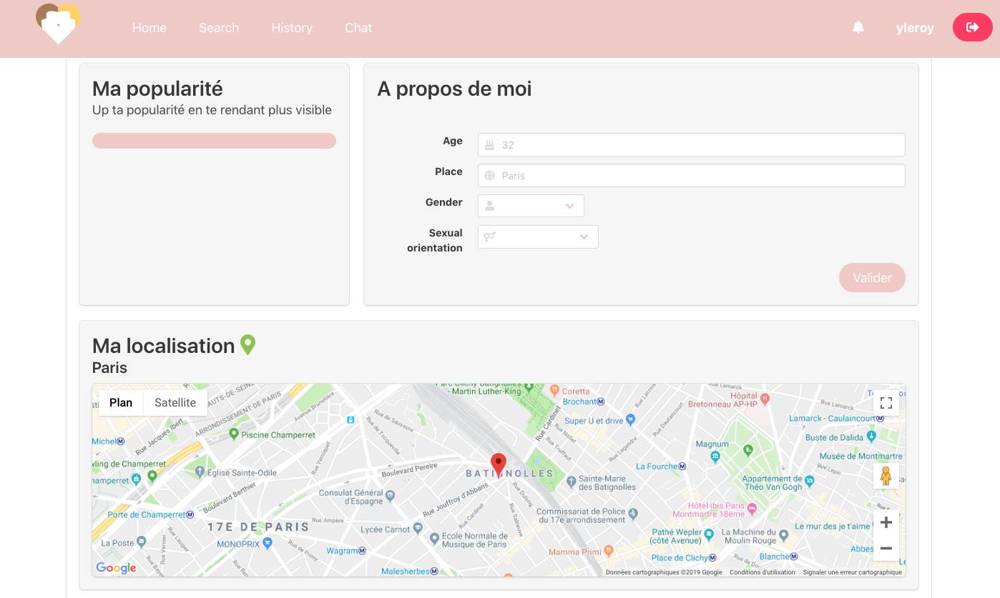

<h1 align="center">
<br>

<br>
</h1>


<h3 align="center">Second project of the web branch of 42 where we had to create a dating site like Tinder.</h3>

---

## Description

Dating website allowing a user to register and to enter personal details and preferences, to be able to match another user with a more or less matching profile, among a selection of profiles of other users that the site will offer.

Once they have matched each other, these two profiles should be able to exchange sweet words and more affinities via a private chat.

## Techno
server-side:

```ruby
 * NodeJs
```
 client-side

 ```ruby
 * VueJs
 * Framework CSS Bulma
 ```
 Database

 ```ruby
 * MySQL
 ```

<h1 align="center">
<br>


<br>
</h1>

## Objectives

### User features

* Allow a user to sign up by asking a email, username, password
* Send a confirm mail

### My profil

* Complete and update his profil
* Popularity Score
* See other profil

<h1 align="center">
<br>


<br>
</h1>

### Match me if you can...

* Have a default suggestion list only if the profil is completed
* Matched by sexual orientation/ localization/ hobbies/ popularity score
* Match proposition has to be sortable and filtrable 

<h1 align="center">
<br>


<br>
</h1>

### Users profil

* Like/ unlike
* History
* Last visit
* Report fake accounts
* Block users

<h1 align="center">
<br>


<br>
</h1>

### Chat

* Create notification that you can see from everywhere
* Only if there is a match


### Notifications

* Like/ unlike
* History
* Message

